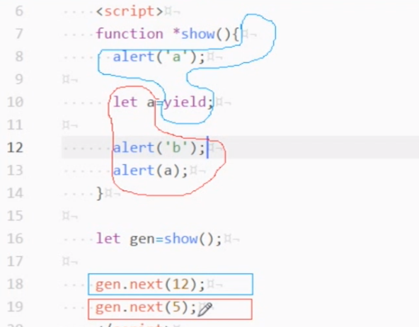

#   generator   生成器，函数
-   普通函数
    -   一路到底
-   generator函数
    -   中间能暂停
-   使用场景
    -   请求数据
    ```
    function 函数(){
        //code
        ajax(xx,function(){
            //code回调方式
        })
        //code
    }
    function *函数(){
        //code
        yield ajax(xxx)
        //yield将整个生成函数分割成若干个普通小函数，通过next()依次执行函数
        //code
    }
    ```
#   yield
-   传参

-   返回